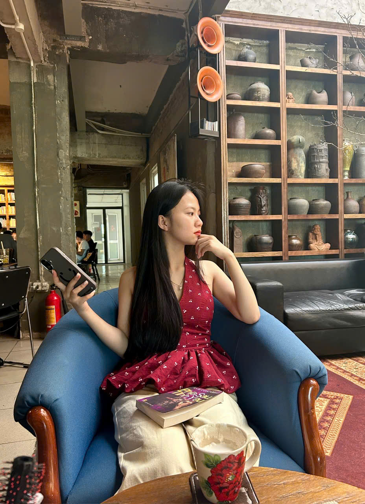

# Cách thay ảnh và lời chúc

Mở file `index.html`.

## Flow cảnh

1. `scene-gift`: hộp quà đầu tiên.
2. `scene-cake`: bánh sinh nhật 3D, chờ 10 giây sẽ tự mở thư.
3. `scene-letter`: thư được gõ chữ từng dòng.
4. `scene-envelope`: phong bì để bấm mở lại thư.

## Thay ảnh trên bánh 3D

Ảnh quanh thân bánh nằm trong các khối `div class="panel"`:

```html
<div class="panel" style="--angle: 0deg">
  <span>anh-1.jpg</span>
  
</div>
```

Bỏ ảnh vào thư mục `assets`. Nếu giữ đúng tên `anh-1.jpg` đến `anh-18.jpg` thì không cần sửa đường dẫn.

Ảnh trong mặt bánh nằm trong `top-disc` và `inside-photos`.

## Sửa lời chúc

Nội dung thư được gõ chữ nằm trong phần:

```html
<div class="letter-source">
```

Nếu viết dài, web sẽ tự gõ trong vùng cuộn của tờ thư để không che mất ảnh polaroid và ngày tháng ở cuối.

Ảnh dưới thư có thể mở nằm trong phần:

```html
<div class="polaroids">
```
